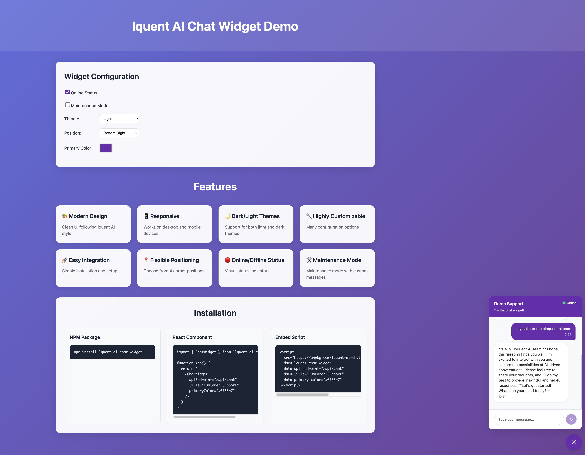
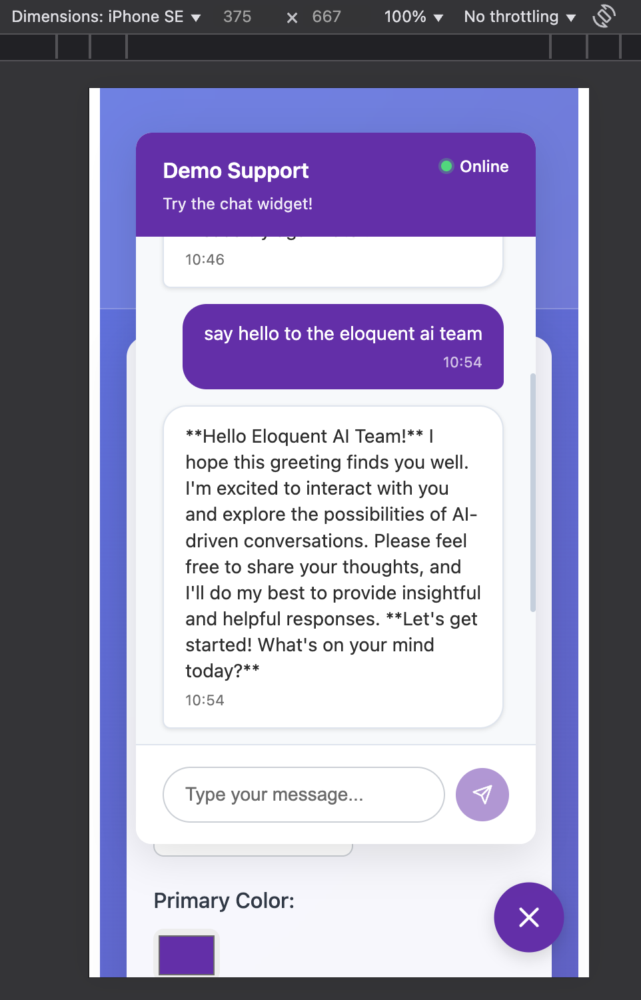
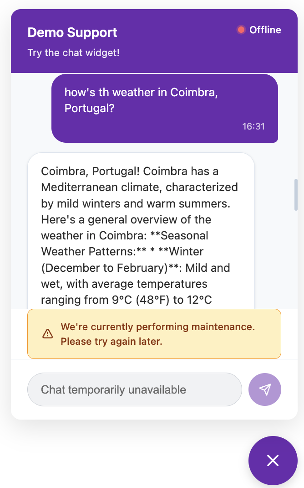

# lquent AI Chat Widget

A modern, embeddable chat widget component for React applications. Built with TypeScript and designed for easy integration into any website.

### Desktop



### Mobile



#### Maintenance Mode



## Features

- **Responsive** - Works on desktop and mobile devices
- **Dark/Light Themes** - Support for both light and dark themes
- **Highly Customizable** - Multiple configuration options
- **Easy Integration** - Simple installation and setup
- **Flexible Positioning** - Choose from 4 corner positions
- **Online/Offline Status** - Visual status indicators
- **Maintenance Mode** - Built-in maintenance mode with custom messages
- **Highly Customizable** - Customizable appearance via props
- **Message Persistence** - Simple local persistence for chat messages using local storage

## Installation

### NPM Package

```bash
npm install @appsilva/lquent-ai-chat-widget
```

## Embedding Options

### 1. Simple Embed

```html
<script
  src="https://unpkg.com/@appsilva/lquent-ai-chat-widget/dist/embed.js"
  data-lquent-chat-widget
  data-api-endpoint="/api/chat"
  data-title="Support"
  data-primary-color="#6f33b7"
></script>
```

### 2. React Component

```tsx
import { ChatWidget } from "@appsilva/lquent-ai-chat-widget";
import "@appsilva/lquent-ai-chat-widget/styles";

function App() {
  return (
    <ChatWidget
      apiEndpoint="/api/chat"
      title="Support"
      primaryColor="#6f33b7"
    />
  );
}
```

### 3. JavaScript API

#### Import the embed script

```html
<script src="https://unpkg.com/@appsilva/lquent-ai-chat-widget/embed"></script>
```

#### Then, initialize the widget programmatically

```javascript
window.lquentChatWidget.init({
  apiEndpoint: "/api/chat",
  title: "Customer Support",
  subtitle: "We're here to help!",
  primaryColor: "#6f33b7",
});
```

## Configuration Options

| Prop                 | Type                                                           | Default                                                             | Description                          |
| -------------------- | -------------------------------------------------------------- | ------------------------------------------------------------------- | ------------------------------------ |
| `apiEndpoint`        | `string`                                                       | `"/api/chat"`                                                       | API endpoint for chat messages       |
| `initialMessage`     | `string`                                                       | `"Hello! How can I help you today?"`                                | Initial message from AI              |
| `theme`              | `"light" \| "dark"`                                            | `"light"`                                                           | Widget theme                         |
| `position`           | `"bottom-right" \| "bottom-left" \| "top-right" \| "top-left"` | `"bottom-right"`                                                    | Widget position                      |
| `primaryColor`       | `string`                                                       | `"#6f33b7"`                                                         | Primary color for buttons and header |
| `title`              | `string`                                                       | `"Chat Support"`                                                    | Widget title                         |
| `subtitle`           | `string`                                                       | `"We're here to help!"`                                             | Widget subtitle                      |
| `isOnline`           | `boolean`                                                      | `true`                                                              | Online/offline status                |
| `isMaintenanceMode`  | `boolean`                                                      | `false`                                                             | Enable maintenance mode              |
| `maintenanceMessage` | `string`                                                       | `"We're currently performing maintenance. Please try again later."` | Maintenance mode message             |
| `className`          | `string`                                                       | `""`                                                                | Additional CSS class                 |
| `style`              | `React.CSSProperties`                                          | `{}`                                                                | Additional inline styles             |

## API Requirements

The widget expects your API endpoint to accept POST requests with the following structure:

### Request

```json
{
  "message": "User's message"
}
```

### Response

```json
{
  "reply": "AI's response message"
}
```

## Development

### Prerequisites

- Node.js 16+
- npm or yarn

### Setup

```bash
npm install
```

### Development Server to test locally (don't forget to update .env file with your GROQ API key)

```bash
npm run dev
npm run server
```

#### or concurrently run dev and server

```bash
npm run dev:full
```

### Build

```bash
# Build React demo
npm run build
```
